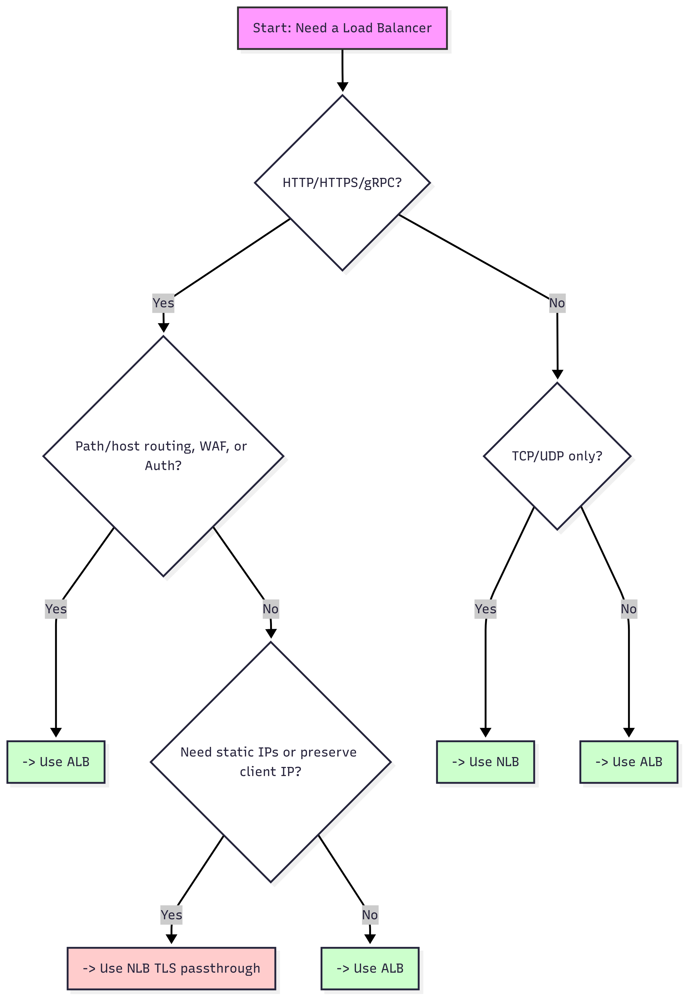

## 🔍 AWS Load Balancers Demystified: When to Use NLB vs ALB

When deploying applications on AWS, one of the most common questions cloud engineers face is:

👉 Should I use an Application Load Balancer (ALB) or a Network Load Balancer (NLB)?

Both are part of Elastic Load Balancing (ELB), but they’re built for very different scenarios. Picking the wrong one can cause headaches later—whether it’s dealing with lost client IPs, lack of routing flexibility, or hitting performance limits.

Let’s break it down.

---

## 🔑 Key Differences Between ALB and NLB

| Feature                      | **Application Load Balancer (ALB)**                                  | **Network Load Balancer (NLB)**                                                       |
| ---------------------------- | -------------------------------------------------------------------- | ------------------------------------------------------------------------------------- |
| **OSI Layer**                | Layer 7 (Application)                                                | Layer 4 (Transport)                                                                   |
| **Protocols**                | HTTP/1.1, HTTP/2, gRPC                                               | TCP, UDP, TLS (layer-4 pass-through)                                                  |
| **Routing**                  | Path-based, host-based, header/query routing; weighted target groups | Simple TCP/UDP port-based routing                                                     |
| **Authentication**           | Built-in support for OIDC, Cognito, SAML                             | Not supported (must handle in app)                                                    |
| **WAF Integration**          | ✅ Yes, can attach AWS WAF                                            | ❌ Not supported directly                                                              |
| **Lambda Targets**           | Supported                                                            | Not supported (but can forward to ALB)                                                |
| **Client IP Preservation**   | Via `X-Forwarded-For` header                                         | ✅ Preserves client IP at target                                                       |
| **Static IPs / Elastic IPs** | ❌ Not supported (uses DNS names)                                     | ✅ Supported per AZ                                                                    |
| **Performance**              | Ideal for web apps (L7 processing adds some latency)                 | Ultra-low latency, millions of requests per second, optimized for real-time workloads |

---

## 📌 When to Use ALB

Use Application Load Balancer when you need application-aware features such as:

- Content-based routing (e.g., /api/*→ microservices cluster, /static/* → S3/CloudFront).

- Native support for HTTP/2 and gRPC.

- Web Application Firewall (WAF) integration for Layer 7 security policies.

- Authentication at the edge (AWS Cognito, OIDC, SAML).

- Serverless backends – ALB can send requests directly to AWS Lambda.

**Example:** You’re deploying a microservices app with APIs, a frontend UI, and a GraphQL gateway. You want to route traffic based on path and apply WAF rules. → ALB is the right fit.

---

## 📌 When to Use NLB

Choose Network Load Balancer when you need raw performance and network-level features:

- Extreme performance – millions of requests/sec, ultra-low latency.
- Protocol flexibility – TCP, UDP, and TLS. Great for IoT, gaming, VoIP, DNS, and messaging.
- Static IPs / Elastic IPs – useful when clients (or partners) must allowlist IPs.
- Preserve source IP at the target (without needing X-Forwarded-For).
- Hybrid scenarios – can front an ALB to provide static IP + TLS pass-through.

**Example:** You’re running a trading app that needs high-throughput TCP and predictable latency, and your clients must whitelist fixed IPs. → NLB is the right choice.

---

## 🛠️ Common Hybrid Pattern

You don’t always have to pick only one. Many production setups place NLB in front of ALB:

- NLB provides static IPs, DDoS resilience, and TLS offloading (if needed).
- ALB provides intelligent routing, WAF, and authentication.

This way, you get the best of both worlds.

---

## 📊 Decision Flow for Your Runbook

Here’s a quick flow you can drop into your internal runbook for deciding between ALB and NLB:

---

## 🚀 Key Takeaways

- ALB = Smart HTTP/S + gRPC routing, WAF, auth.
- NLB = High performance, static IPs, TCP/UDP/TLS, client IP preservation.
- NLB + ALB together = Best of both worlds for real-world enterprise needs.

When in doubt, ask: “Do I need L7 features or raw network performance?” That question usually points you to the right load balancer.

---

## ✅ Engineer’s Checklist

- [ ] Is the traffic HTTP/S or gRPC?\
If yes, prefer ALB.

- [ ] Do you need path/host/header-based routing?\
If yes, choose ALB.

- [ ] Do you require WAF integration or Cognito/OIDC authentication?\
If yes, choose ALB.

- [ ] Do you need static IP addresses or Elastic IPs?\
If yes, use NLB.

- [ ] Do you need TCP, UDP, or TLS pass-through?\
If yes, use NLB.

- [ ] Do you need both static IPs and L7 routing/security?\
If yes, use a hybrid NLB → ALB pattern.

---

💬 **Got questions?**  
Reach out on [LinkedIn](https://www.linkedin.com/in/mohammedovich) or drop a comment.
