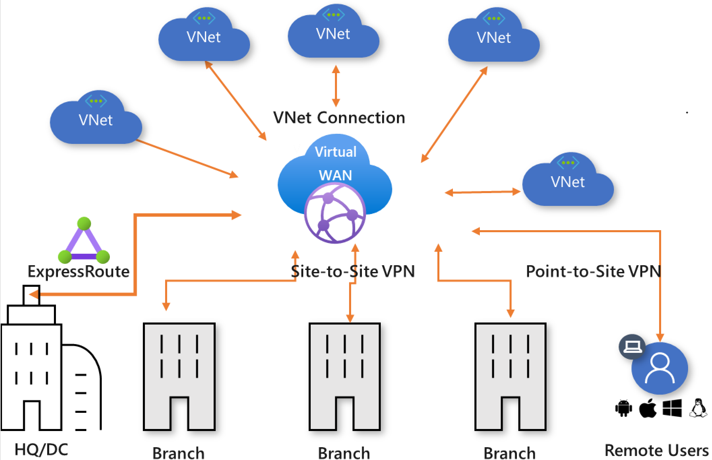
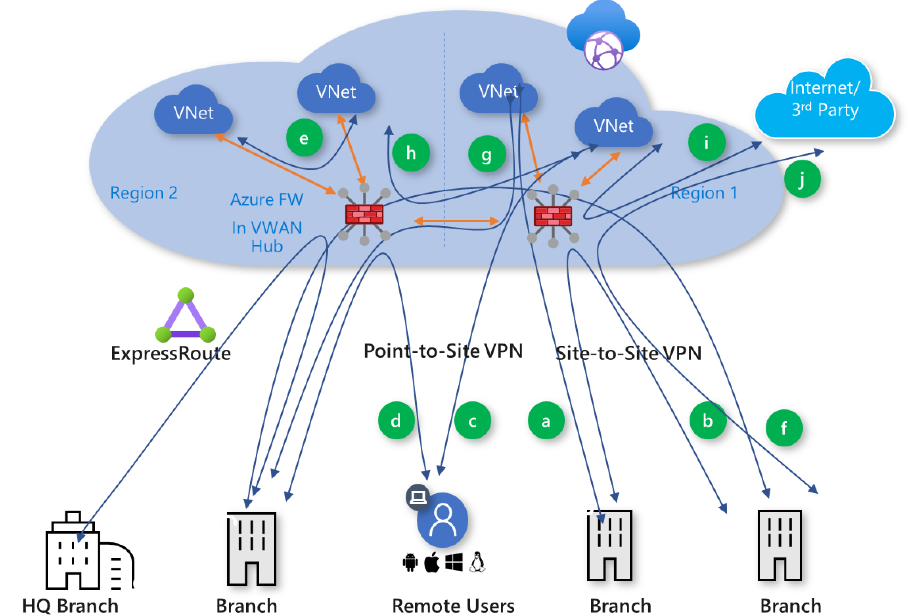

Azure Virtual WAN is a managed transit network service that abstracts away the complexity of building a global network fabric.  VNets, branches and remote users connect to a hub via VNet connections, **ExpressRoute**, **site‑to‑site VPN** and **point‑to‑site VPN**.  The hub in turn provides any‑to‑any connectivity through Microsoft’s backbone.  In a typical deployment the hub also becomes a **secure virtual hub** by enabling an Azure Firewall or a third‑party network virtual appliance (NVA).  The following diagram from Microsoft’s documentation shows the core concept—a Virtual WAN hub sits in the centre while VNets, on‑premises branches and remote users connect via various gateways.

When I started building a multi‑regional Virtual WAN environment, I assumed that Azure Firewall would behave like a regular hub firewall—something I could share across hubs or treat like an appliance in a traditional hub‑and‑spoke network.  That assumption was wrong.  Azure Firewall integrates with Virtual WAN through **Secured Virtual Hubs** and **routing intent**, which comes with important limitations.  In this post I’ll share my experiences, highlight the limitations I discovered and provide some recommendations for designing around them.

## How Azure Firewall integrates with Virtual WAN

In a secured virtual hub, Azure Firewall becomes the next‑hop for traffic that flows through the hub.  Routing policies define whether **Internet** and/or **private** traffic should traverse the firewall.  Each hub can have at most one **Internet traffic routing policy** and one **private traffic routing policy**.  The Internet policy advertises a default route (`0.0.0.0/0`) to all connections, while the private policy sends all branch‑to‑branch, branch‑to‑VNet and inter‑hub traffic to the firewall.  These policies are declarative: they simplify the configuration of transitive routing but also constrain what you can do.

The diagram below illustrates a **secured virtual hub**.  In my design, we deployed hubs in multiple regions with an Azure Firewall in each.  Branches and VNets connect via VPN gateways, and routing intent directs traffic through the firewall for inspection.

### Limitations I encountered

| Limitation | Impact | Evidence |
|---|---|---|
|**Firewalls cannot be shared across hubs**|Each Virtual WAN hub must have its own firewall. You cannot point traffic to a firewall in another hub or share a firewall across hubs.|Virtual WAN FAQ notes that custom routes pointing to a firewall in a different hub will fail and that you must deploy a firewall per hub.|
|**Cannot update availability zones post‑deployment**|If you deploy an Azure Firewall without availability zones, you cannot enable zones later. You must delete and recreate the firewall.|Virtual WAN FAQ explains that there’s no way to configure availability zones on an existing firewall; redeployment is required.|
|**Default routes don’t propagate between hubs**|A default route learned via a firewall or forced‑tunnelling propagates only within the local hub; it does not propagate to other hubs.  Each hub therefore needs its own Internet egress and firewall.|The FAQ clarifies that the default route (`0.0.0.0/0`) is not propagated between hubs; it is only advertised inside a hub when the Internet traffic policy is configured.|
|**Only one routing policy per traffic type**|A hub can have at most one Internet traffic policy and one private traffic policy, each pointing to a single next hop.|Routing intent documentation states that each policy can only specify one next‑hop resource and that multiple policies cannot be used to send different prefixes to different firewalls.|
|**Combining Azure Firewall and a separate NVA in the same hub is not supported**|If you deploy an SD‑WAN NVA and Azure Firewall in the same hub, the NVA cannot forward traffic to the firewall for inspection; the platform doesn’t support chaining these devices.|The routing intent documentation lists combining an SD‑WAN NVA and a separate firewall as a known limitation.|
|**Peered networks cannot route back through the firewall**|I attempted to peer a spoke VNet containing an NVA to the hub and send traffic back to the hub’s firewall.  Microsoft does not support this; traffic cannot be routed from a peered VNet through the firewall and back to the NVA.|A CloudNation case study notes that combining Azure Firewall and an NVA over a peered connection is not supported; they had to deploy VPN gateways and connect through the hub instead.|
|**Limitations in general Azure Firewall behaviour**|Separate from Virtual WAN, Azure Firewall has its own constraints: DNAT rules don’t work with private IP addresses, network filtering works only for TCP/UDP protocols on outbound Internet traffic, and firewalls cannot be moved to a different subscription or resource group.|The Azure Firewall known issues list mentions that network filtering for protocols other than TCP/UDP is not supported, that you cannot move a firewall between resource groups, and that DNAT rules with private IPs prevent deallocation.|
|**Routing intent isn’t available in every Azure environment**|Routing intent and policies (used to send traffic through the firewall) aren’t available in Azure operated by 21Vianet and cannot be combined with custom route tables.|The documentation lists several known limitations: routing intent isn’t available in certain regions, custom route tables cannot be used with routing intent, and static routes on VNet connections are not applied to the firewall’s next hop.|

## My takeaways and lessons learned

### Deploy a firewall per hub and region

My biggest misstep was assuming I could centralise firewalling in one hub and route all regions through it.  Because Virtual WAN does not allow **firewall sharing between hubs**, each hub must have its own firewall.  This adds cost and operational overhead but avoids a brittle design.  If your solution spans multiple regions, budget for multiple firewalls and plan automation to keep rule collections consistent.

### Understand routing intent constraints

Routing intent simplifies route advertisement—especially the **Internet traffic policy** that advertises a default route to spokes.  However, you only get **one policy per traffic type**, and each points to a single next hop.  If you need more granular inspection (for example, sending certain prefixes to an NVA and others to Azure Firewall), Virtual WAN won’t help.  Consider using a standard hub‑and‑spoke topology instead, or wait for Microsoft to enhance the feature.

### Plan for availability zones up front

High availability in Azure Firewall is achieved by deploying the firewall in an **availability zone**.  Unfortunately you cannot change zone settings after deployment.  In my first environment I skipped zones to accelerate deployment and later needed them; the only option was to destroy and recreate the firewall.  Plan the zone configuration at the start of your project.

### Avoid peering an NVA with the secure hub

My environment required both an **SD‑WAN appliance** and **Azure Firewall**.  I attempted to peer an NVA VNet to the hub and route traffic back through the firewall.  Microsoft does **not support chaining NVAs with Azure Firewall via peering**.  The supported pattern is to deploy VPN or ExpressRoute gateways in the NVA VNet and create Virtual WAN connections, letting the hub handle the traffic.  This may seem counter‑intuitive but it ensures that the platform can properly advertise routes and inspect traffic.

### Be aware of firewall‑level quirks

Some Azure Firewall quirks surprised me.  DNAT rules can’t use private IP addresses; you can’t migrate a firewall between subscriptions or resource groups; and some protocols (ICMP, GRE) aren’t inspected for Internet‑bound traffic.  These aren’t Virtual WAN limitations but they become relevant when you integrate the firewall into your network architecture.

## Final thoughts

Azure Virtual WAN and Azure Firewall make it easier to build a secure, globally connected network.  However, the **integration is opinionated**.  You must deploy a firewall per hub, plan your routing policies carefully and accept that certain advanced scenarios—like chaining an SD‑WAN appliance with the firewall—aren’t supported.  By understanding these constraints ahead of time and building your design around them, you can avoid costly redeployments and deliver a robust, scalable network for your organisation.
